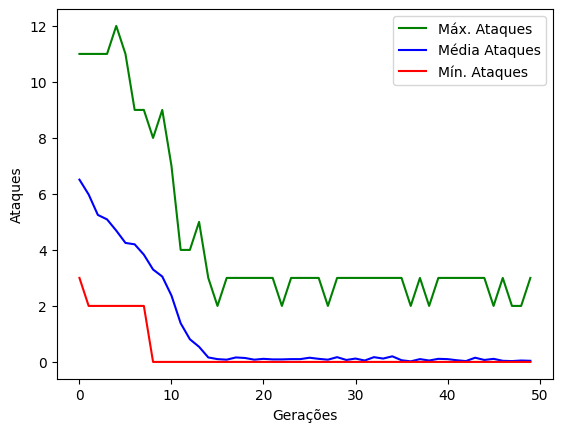
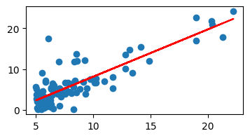

### INF01048 - Inteligência Artificial - 2022/2 - Turma A

- Jose Henrique Lima Marques - 324502<br>
- Léo Hernandes de Vasconcelos - 323961<br>
- Vítor Caruso Rodrigues Ferrer - 327023

# Genética da realeza 👑

O problema da genética da realeza resume-se em implementar um algoritmo genético que minimize o número de ataques entre oito rainhas em um tabuleiro de xadrez.

### Bibliotecas adicionais usadas:
- tqdm
```
pip install tqdm
```
- Matplotlib
```
pip install matplotlib
```

## Valores usados 🔢

A melhor versão do algoritmo genético foi obtida com os seguintes parâmetros:
```
Número de gerações = 50
Número de indivíduos = 100
Tamanho do torneio = 4
Probabilidade de mutação = 0.05
Número de indivíduos no elitismo = 4
```
O melhor indídivuo obteve um total de 0 ataques com a configuração **[5, 1, 8, 6, 3, 7, 2, 4]**.
## Resultados 📊



***

# Não me perguntes onde fica o Alegrete... 🤔

Esse é um clássico problema de regressão linear com duas variáveis, em que se quer prever o preço de uma fazenda em Alegrete dada a área do terreno. 

## Valores usados 🔢

Os seguintes parâmetros foram os que obtiveram o menor **erro quadrático médio** que foi igual à **0.297**:
```
Theta 0 = 0
Theta 1 = 0
Alpha = 0.01
Número de iterações = 150
```
O dataset foi normalizado usando o método de *standardization*, em que consiste em subtrair cada ocorrência das variáveis pela média de sua coluna e dividir pelo desvio padrão de sua coluna. A consequência dessa normalização é que os valores seram previstos normalizados, entretanto, uma vez que temos acesso a todo o conjunto de dados, podemos aplicar o processo inverso após prever os valores, e então obter os valores reais de preço.



